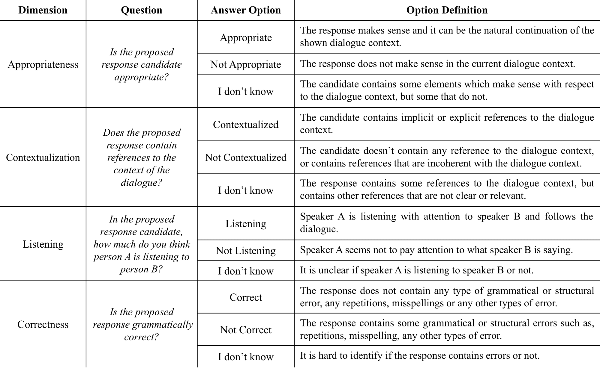
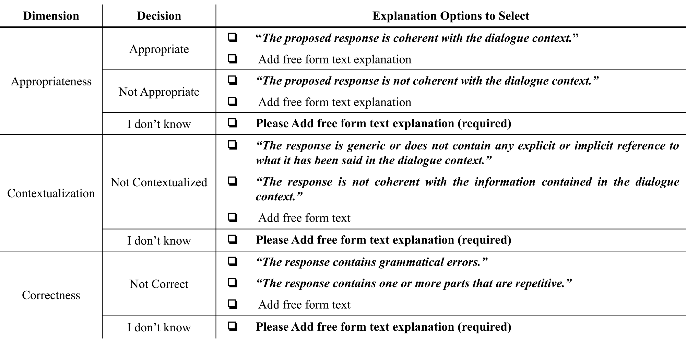
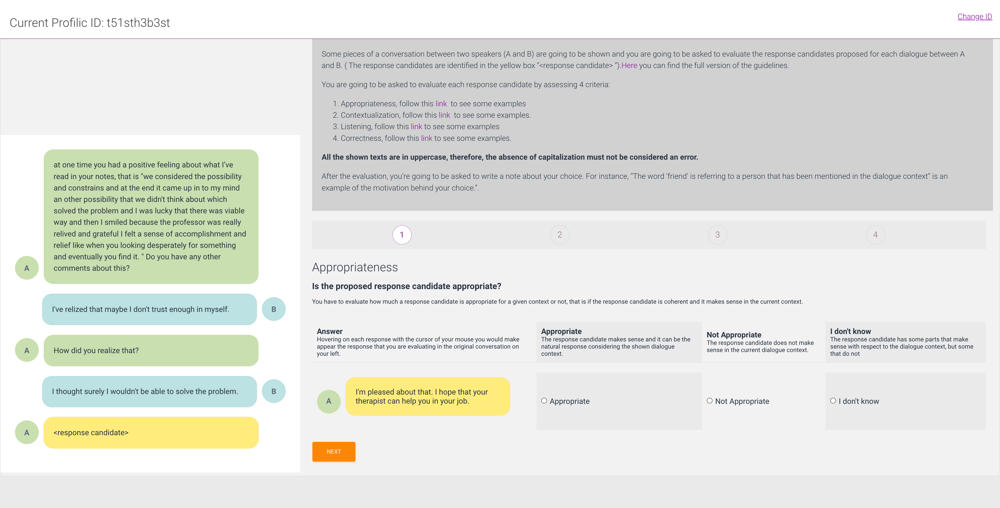

# Human Evaluation Protocol [v1.0]
## Introduction
We propose a Protocol for Human Evaluation of automatically generated text. The Protocol consists of all required steps and materials in a transparent and detailed form, including the task design, recruitment of the annotators, execution of the task, and result reporting. Such protocol and process can be used as-is, as-a-whole, in-part, or modified and extended while maintaining public access to versioning and reference in publications. We invite the community to use this protocol - or its future community amended versions - as a transparent, replicable, and comparable approach for the task of human evaluation of generated responses. The reference paper of this protocol is accessible at [PAPER](./paper.pdf) and the corresponding poster is accessible at [POSTER](./poster.pdf). This work was presented at EMNLP 2022, the 2nd Workshop on Natural Language Generation, Evaluation, and Metrics.

## Usage
This project can be used as it is, or you can modify and/or extend it depending on your needs. In case of modification or addition we would ask you to add this information to the this project in order to improve and generalize this protocol to the evaluation of a broader set of natural language generation tasks.
### Guidelines
The guidelines are the main pillar of the protocol. This means that any substantial changes will produce a new version of the protocol. The guidelines that we used are saved in the **guidelines** folder. This folder contains all the translation of the original guidelines which are stored in eng and ita folders. You can translate them in language that you need and save a copy of the translated guidelines in this folder. The corresponding subfolder has to be named with the language code in [ISO 639-2](https://en.wikipedia.org/wiki/ISO_639-2) format, containing a pdf of the guidelines. The translate has to follow the template provided in the template subfolder.
### Quality Dimensions
This version [v1.0] of the protocol currently supports the following dimensions:
- **Appropriateness**: whether the proposed response candidate makes sense with respect to the dialogue history; and to investigate if it is a proper continuation of the given dialogue (thus coherent).
- **Contextualization**: whether the proposed response candidate contains references to the dialogue context (thus not generic); and to investigate whether the response refers to non-existing or contradicting information (such as model hallucination).
- **Listening**: whether the speaker of the proposed response is following the dialogue with attention (note that generic responses are also indicating that the speaker is not following the dialogue).
- **Correctness**: whether the response candidate is correct considering the grammar, syntax and structure of the response.

#### Questions
The questions we asked the annotators to evaluate the 4 dimensions are the following:



The annotators had the possibility to add explanations about their choice. To do this, the annotators can select a predefined explanation or add free from text. The following table reports the explanation options for each answer option and dimension:



#### Scripts
In this folder we added the scripts we used in this project as those used for computing the agreement.
##### Inter-Annotator Agreement (IAA)
Each annotation task has it is own data schema, which may depend on the crowdsourcing platform used and task to be evaluated. For this reason, it is hard to find a standard input file that contains all the information of the annotation, used to compute directly the IAA. For this reason, we share the single functions we used, with their input format, to compute the agreement along with a set of useful suggestions and considerations. To have reliable IAA values, we used standard R libraries inside a python script. To do this, we used the r2py python library available [here](https://rpy2.github.io). Besides installing r2py, you have to install R and the following libraries:
```r
install.packages("lpSolve")
install.packages("irr")
```
## User Interface
The user interface we used is in the **User Interface** folder. This folder is organized in order to contain all the UI used to evaluate the Quality Dimensions. Since each annotation task is different the UI may change but can be also improved. Thus, if you develop a new UI for assessing the same 4 Quality Dimensions using the same guidelines you should add it in this folder. The folder is organized as follow:
- user_interface
  - [name of the task to evaluate]
    - An unique id that represents the UI

All the UI folders should also contain a screenshot of the UI main page.

- **dialogue-evaluation**
  - *geppetto-vs-it5*: 

## License
Human Evaluation Protocol is licensed with GPL-3.0-or-later, as found in the LICENSE file.
## Changelog
The brach master correspond to the most updated version, while other versions will be stored in other branches.

*Add all changes you did compared with the previous version*

## How to cite us 
```
@inproceedings{mousavi-etal-2022-evaluation,
    title = "Evaluation of Response Generation Models: Shouldn{'}t It Be Shareable and Replicable?",
    author = "Mousavi, Seyed Mahed  and
      Roccabruna, Gabriel  and
      Lorandi, Michela  and
      Caldarella, Simone  and
      Riccardi, Giuseppe",
    booktitle = "Proceedings of the 2nd Workshop on Natural Language Generation, Evaluation, and Metrics (GEM)",
    month = dec,
    year = "2022",
    address = "Abu Dhabi, United Arab Emirates (Hybrid)",
    publisher = "Association for Computational Linguistics",
    url = "https://aclanthology.org/2022.gem-1.12",
    pages = "136--147",
    abstract = "Human Evaluation (HE) of automatically generated responses is necessary for the advancement of human-machine dialogue research. Current automatic evaluation measures are poor surrogates, at best. There are no agreed-upon HE protocols and it is difficult to develop them. As a result, researchers either perform non-replicable, non-transparent and inconsistent procedures or, worse, limit themselves to automated metrics. We propose to standardize the human evaluation of response generation models by publicly sharing a detailed protocol. The proposal includes the task design, annotators recruitment, task execution, and annotation reporting. Such protocol and process can be used as-is, as-a-whole, in-part, or modified and extended by the research community. We validate the protocol by evaluating two conversationally fine-tuned state-of-the-art models (GPT-2 and T5) for the complex task of personalized response generation. We invite the community to use this protocol - or its future community amended versions - as a transparent, replicable, and comparable approach to HE of generated responses.",
}
```
